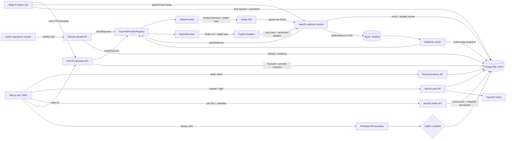

# PayFlow

PayFlow is a full-stack payment-system portfolio project implemented one
acceptance-gated stage at a time from the accompanying Codex implementation
specification.

> Current delivery: **Stage 8 — PayPal + Queue (accepted)**.
> Stripe Test and PayPal Sandbox share one provider-neutral business boundary;
> verified webhooks are persisted, queued in BullMQ, and processed by a worker
> with bounded, observable retries. All specified Stage 8 local and remote
> gates pass; Stage 9 may begin.

## Current architecture



The V1 boundary remains a modular monolith. PostgreSQL is the source of truth,
Prisma owns schema and migrations, passwords use bcrypt cost 12, and the API—not
the browser—enforces authentication, roles, ownership, and order totals. Product
and order amounts are integer minor units; floating-point money is forbidden.

## Payment provider boundary

`@payflow/payment-core` defines the framework-neutral contract, normalized
states/actions/errors, and a registry for provider selection.
`@payflow/payment-stripe` maps it to current hosted Checkout, PaymentIntents,
Refunds, and signed Events. `@payflow/payment-paypal` maps the same contract to
Sandbox Orders v2, capture/refund APIs, OAuth, and official webhook verification.

`@payflow/payment-domain` owns shared state transitions and queued event
projection. `@payflow/payment-queue` owns BullMQ policy; `apps/worker` is the
only asynchronous runtime. NestJS business services never import a provider SDK.

## Requirements

- Node.js 20.9 or newer (verified with Node 24)
- pnpm 11.16.0
- Docker Desktop with Docker Compose v2

## Start everything with Docker

For a disposable local sandbox, the Compose defaults are sufficient:

```powershell
docker compose up --build --wait
```

Override `JWT_SECRET`, `PAYFLOW_ADMIN_EMAIL`, and `PAYFLOW_ADMIN_PASSWORD` in a
local `.env` before using a persistent environment. The API applies committed
migrations and runs the idempotent sandbox seed before it starts.

If port 5432 is already occupied, keep the container port unchanged and override
only the host port:

```powershell
$env:POSTGRES_PORT = '55432'
docker compose up --build --wait
```

Docker Desktop Buildx can reject non-ASCII Windows workspace paths with an
`x-docker-expose-session-sharedkey` error. If that occurs, run the command from
an ASCII-only clone path or an ASCII-only directory junction targeting this
repository. This is a Docker build-transport limitation; repository paths do
not need to change.

Services and interfaces:

- Web catalog: <http://localhost:3000>
- Registration: <http://localhost:3000/register>
- Login: <http://localhost:3000/login>
- Cart: <http://localhost:3000/cart>
- Customer orders: <http://localhost:3000/orders>
- Admin operations: <http://localhost:3000/admin>
- API information: <http://localhost:4000>
- API health: <http://localhost:4000/health>
- OpenAPI UI: <http://localhost:4000/docs>
- OpenAPI JSON: <http://localhost:4000/openapi.json>
- Redis/BullMQ: `localhost:6379` (transport only; no public HTTP interface)

Stop services without deleting database data:

```powershell
docker compose down
```

## Current API

| Method | Path                          | Access | Purpose                                    |
| ------ | ----------------------------- | ------ | ------------------------------------------ |
| POST   | `/auth/register`              | Public | Create a USER and issue a JWT              |
| POST   | `/auth/login`                 | Public | Verify credentials and issue JWT           |
| GET    | `/auth/me`                    | JWT    | Return the safe current-user DTO           |
| GET    | `/products`                   | Public | List active products                       |
| GET    | `/products/:id`               | Public | Read one active product                    |
| POST   | `/orders`                     | JWT    | Create a server-priced order               |
| GET    | `/orders`                     | JWT    | List current user's orders                 |
| GET    | `/orders/:id`                 | JWT    | Read owned order, payments, and refunds    |
| POST   | `/orders/:id/cancel`          | JWT    | Cancel an owned pending order              |
| POST   | `/payments/checkout-session`  | JWT    | Create/reuse Stripe or PayPal checkout     |
| GET    | `/payments/:id`               | JWT    | Read an owned local payment and refunds    |
| POST   | `/webhooks/stripe`            | Public | Verify, persist, and queue a Stripe Event  |
| POST   | `/webhooks/paypal`            | Public | Verify, persist, and queue a PayPal Event  |
| GET    | `/admin/profile`              | ADMIN  | Verify the administrator boundary          |
| GET    | `/admin/dashboard`            | ADMIN  | Read payment-system operational counters   |
| GET    | `/admin/orders[/:id]`         | ADMIN  | Paginate/search and inspect orders         |
| GET    | `/admin/payments[/:id]`       | ADMIN  | Paginate/search payments and attempts      |
| POST   | `/admin/payments/:id/refunds` | ADMIN  | Create idempotent full/partial refund      |
| GET    | `/admin/refunds`              | ADMIN  | Paginate provider refund outcomes          |
| GET    | `/admin/webhooks`             | ADMIN  | Inspect event duplicates and failures      |
| GET    | `/admin/queues/webhooks`      | ADMIN  | Inspect queue state, retries, and failures |
| GET    | `/admin/audit-logs`           | ADMIN  | Inspect actor/reason/target history        |

Public registration cannot choose a role. Order creation accepts only product
IDs and quantities; any client price field is rejected, and accepted totals are
calculated from current database products. Browser visibility is not an
authorization control: every administration endpoint independently requires
the API-verified ADMIN role.

## Local development

```powershell
Copy-Item apps/api/.env.example apps/api/.env
Copy-Item apps/worker/.env.example apps/worker/.env
Copy-Item apps/web/.env.example apps/web/.env.local
pnpm install --frozen-lockfile
docker compose up -d postgres redis
pnpm db:generate
pnpm db:migrate:deploy
pnpm db:seed
pnpm dev
```

Set the database, JWT, and seed variables from the example files in the current
shell before migration, seed, or API commands. Real `.env` files are ignored by
Git.

Stripe Checkout is disabled safely until `STRIPE_SECRET_KEY` is set to a test or
sandbox key. A least-privilege restricted test key (`rk_test_...`) is preferred;
`sk_test_...` is accepted for sandbox development. Live keys are rejected.
Secrets belong only in the ignored environment or a secret manager and must
never be committed, logged, or embedded in browser code.

PayPal is disabled until `PAYPAL_CLIENT_ID`, `PAYPAL_CLIENT_SECRET`, and the
Sandbox endpoint's `PAYPAL_WEBHOOK_ID` are configured. `PAYPAL_ENV` is locked to
`sandbox`; live PayPal operation is rejected.

Webhook processing also fails closed until `STRIPE_WEBHOOK_SECRET` contains the
signing secret for the exact Stripe sandbox endpoint. For local forwarding, use
the official Stripe CLI in a separate terminal:

```powershell
stripe login
stripe listen --events checkout.session.completed,checkout.session.async_payment_succeeded,checkout.session.async_payment_failed,payment_intent.processing,payment_intent.succeeded,payment_intent.payment_failed,refund.created,refund.updated,refund.failed,charge.refunded --forward-to localhost:4000/webhooks/stripe
```

Copy the displayed `whsec_...` value into the ignored `apps/api/.env`, restart
the API and worker, then complete a Stripe Test Checkout. A CLI listener secret
and a Dashboard endpoint secret are different. Returning to PayFlow never
proves payment—the signed webhook must be queued and committed by the worker.

Enable the tracked pre-commit payment-secret scan once per clone:

```powershell
git config core.hooksPath .githooks
pnpm secrets:scan
```

## Quality gates

Run formatting, tracked-secret scanning, static checks, unit tests, and
production builds:

```powershell
pnpm run ci
```

Run the database-backed acceptance suite after migration and seed:

```powershell
pnpm db:migrate:deploy
pnpm db:seed
$env:RUN_REDIS_INTEGRATION = 'true'
pnpm test:e2e
pnpm --filter @payflow/payment-queue test
```

Run only the ten Stage 6 failure scenarios:

```powershell
pnpm db:migrate:deploy
pnpm db:seed
pnpm test:failure-lab
```

The Failure Lab uses the real NestJS HTTP application, exact raw webhook body,
Stripe signature verification, Prisma repositories, and PostgreSQL transactions.
Deterministic test gateways replace only outbound Stripe network calls, so
timeouts and concurrency can be repeated without creating external charges or
refunds. Expected 502/500 log entries are deliberate injections in the timeout,
restart, and transaction-rollback scenarios; a passing Jest result confirms
recovery and invariants.

The GitHub Actions workflow starts PostgreSQL 18 and Redis 8.8, scans tracked
files for payment secrets, applies every migration, seeds the sandbox, and runs
both adapter packages, BullMQ retry integration, the API E2E suite, and all ten
Failure Lab scenarios. Stage 8 implementation/acceptance evidence is recorded
in [`docs/stages/stage-8.md`](docs/stages/stage-8.md), the provider contract in
[`docs/provider-adapter.md`](docs/provider-adapter.md), and the unchanged
Failure Lab evidence in
[`docs/failure-lab-report.md`](docs/failure-lab-report.md).

## Workspace layout

```text
apps/
  web/        Next.js 16 App Router and Tailwind CSS
  api/        NestJS 11 modular-monolith REST API and Swagger
  worker/     BullMQ webhook processor (no public HTTP surface)
packages/
  database/   Prisma 7 schema, migrations, seed, generated client boundary
  payment-core/    Provider-neutral contract, states, and errors
  payment-domain/  Shared state machines and webhook projection
  payment-paypal/  PayPal Sandbox Orders/capture/refund adapter
  payment-queue/   Redis/BullMQ queue policy and snapshots
  payment-stripe/  Stripe SDK adapter and contract tests
  shared/     Framework-neutral shared contracts
docs/
  adr/        Architecture decision records
  design/     Stage-scoped visual specifications and QA captures
  refund-design.md   Refund locking, idempotency, and administration contract
  failure-lab-report.md  Stage 6 fault-injection scenarios and evidence
  provider-adapter.md    Shared Stripe/PayPal contract and mapping
  webhook-design.md  Raw-body verification, queue, retry, and worker contract
infra/
  docker/     Container notes
```

## Framework compatibility notes

Prisma 7 moves connection configuration to `prisma.config.ts`, requires an
explicit generated-client output and driver adapter, and runs seeds only through
an explicit `prisma db seed`. This repository follows those official APIs with
`@prisma/adapter-pg` and `migrations.seed`. Next.js route-aware helpers are
generated with `next typegen` before standalone TypeScript checks.
NestJS 11's supported `rawBody: true` application option retains exact request
bytes for both provider verification paths while keeping the built-in JSON
parser. Stripe Node 22.5.0 targets API `2026-07-29.dahlia`; Checkout Sessions
include `integration_identifier` and deliberately omit `payment_method_types`
so Dashboard-managed dynamic payment methods remain available.

## Safety boundary

PayFlow is sandbox-only. No live payment credentials or real funds belong in
this project, and the application must never store card numbers or CVC values.
