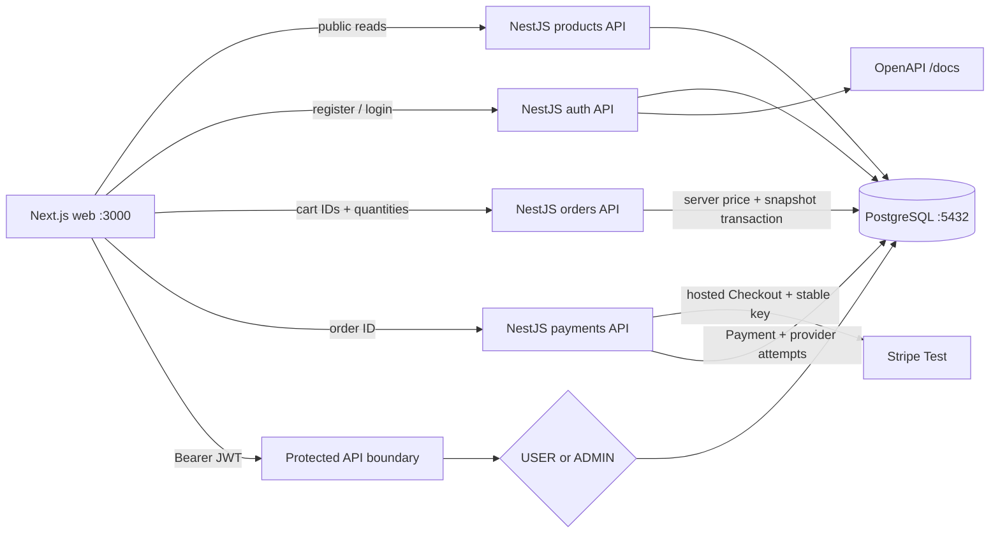

# PayFlow

PayFlow is a full-stack payment-system portfolio project implemented one
acceptance-gated stage at a time from the accompanying Codex implementation
specification.

> Current delivery: **Stage 3 — Stripe Payment (accepted)**. A real Stripe Test
> hosted page and repeated-session idempotency have passed. Stage 4 webhook work
> is next and has not yet changed payment state.

## Current architecture



The V1 boundary remains a modular monolith. PostgreSQL is the source of truth,
Prisma owns schema and migrations, passwords use bcrypt cost 12, and the API—not
the browser—enforces authentication, roles, ownership, and order totals. Product
and order amounts are integer minor units; floating-point money is forbidden.

## Requirements

- Node.js 20.9 or newer (verified with Node 24)
- pnpm 11.16.0
- Docker Desktop with Docker Compose v2

## Start everything with Docker

For a disposable local sandbox, the Compose defaults are sufficient:

```powershell
docker compose up --build --wait
```

Override `JWT_SECRET`, `PAYFLOW_ADMIN_EMAIL`, and `PAYFLOW_ADMIN_PASSWORD` in a
local `.env` before using a persistent environment. The API applies committed
migrations and runs the idempotent sandbox seed before it starts.

If port 5432 is already occupied, keep the container port unchanged and override
only the host port:

```powershell
$env:POSTGRES_PORT = '55432'
docker compose up --build --wait
```

Docker Desktop Buildx can reject non-ASCII Windows workspace paths with an
`x-docker-expose-session-sharedkey` error. If that occurs, run the command from
an ASCII-only clone path or an ASCII-only directory junction targeting this
repository. This is a Docker build-transport limitation; repository paths do
not need to change.

Services and interfaces:

- Web catalog: <http://localhost:3000>
- Registration: <http://localhost:3000/register>
- Login: <http://localhost:3000/login>
- Cart: <http://localhost:3000/cart>
- Customer orders: <http://localhost:3000/orders>
- API information: <http://localhost:4000>
- API health: <http://localhost:4000/health>
- OpenAPI UI: <http://localhost:4000/docs>
- OpenAPI JSON: <http://localhost:4000/openapi.json>

Stop services without deleting database data:

```powershell
docker compose down
```

## Current API

| Method | Path                         | Access | Purpose                              |
| ------ | ---------------------------- | ------ | ------------------------------------ |
| POST   | `/auth/register`             | Public | Create a USER and issue a JWT        |
| POST   | `/auth/login`                | Public | Verify credentials and issue JWT     |
| GET    | `/auth/me`                   | JWT    | Return the safe current-user DTO     |
| GET    | `/products`                  | Public | List active products                 |
| GET    | `/products/:id`              | Public | Read one active product              |
| GET    | `/admin/profile`             | ADMIN  | Verify the administrator boundary    |
| POST   | `/orders`                    | JWT    | Create a server-priced order         |
| GET    | `/orders`                    | JWT    | List current user's orders           |
| GET    | `/orders/:id`                | JWT    | Read an owned order and snapshots    |
| POST   | `/orders/:id/cancel`         | JWT    | Cancel an owned pending order        |
| POST   | `/payments/checkout-session` | JWT    | Create or reuse Stripe Test Checkout |
| GET    | `/payments/:id`              | JWT    | Read an owned local payment          |

Public registration cannot choose a role. Order creation accepts only product
IDs and quantities; any client price field is rejected, and accepted totals are
calculated from current database products. The `/admin/profile` route remains
an RBAC verifier, not the Stage 5 admin business console.

## Local development

```powershell
Copy-Item apps/api/.env.example apps/api/.env
Copy-Item apps/web/.env.example apps/web/.env.local
pnpm install --frozen-lockfile
docker compose up -d postgres
pnpm db:generate
pnpm db:migrate:deploy
pnpm db:seed
pnpm dev
```

Set the database, JWT, and seed variables from the example files in the current
shell before migration, seed, or API commands. Real `.env` files are ignored by
Git.

Stripe Checkout is disabled safely until `STRIPE_SECRET_KEY` is set to a test or
sandbox key (`sk_test_...` or `rk_test_...`). Live keys are rejected. Never
commit or paste a secret key into source or documentation.

## Quality gates

Run static checks, unit tests, and production builds:

```powershell
pnpm run ci
```

Run the database-backed acceptance suite after migration and seed:

```powershell
pnpm db:migrate:deploy
pnpm db:seed
pnpm test:e2e
```

The GitHub Actions workflow starts PostgreSQL 18 and performs both groups. Full
evidence is recorded in [`docs/stages/stage-3.md`](docs/stages/stage-3.md).

## Workspace layout

```text
apps/
  web/        Next.js 16 App Router and Tailwind CSS
  api/        NestJS 11 modular-monolith REST API and Swagger
packages/
  database/   Prisma 7 schema, migrations, seed, generated client boundary
  shared/     Framework-neutral shared contracts
docs/
  adr/        Architecture decision records
  design/     Stage-scoped visual specifications and QA captures
infra/
  docker/     Container notes
```

## Framework compatibility notes

Prisma 7 moves connection configuration to `prisma.config.ts`, requires an
explicit generated-client output and driver adapter, and runs seeds only through
an explicit `prisma db seed`. This repository follows those official APIs with
`@prisma/adapter-pg` and `migrations.seed`. Next.js route-aware helpers are
generated with `next typegen` before standalone TypeScript checks.

## Safety boundary

PayFlow is sandbox-only. No live payment credentials or real funds belong in
this project, and the application must never store card numbers or CVC values.
