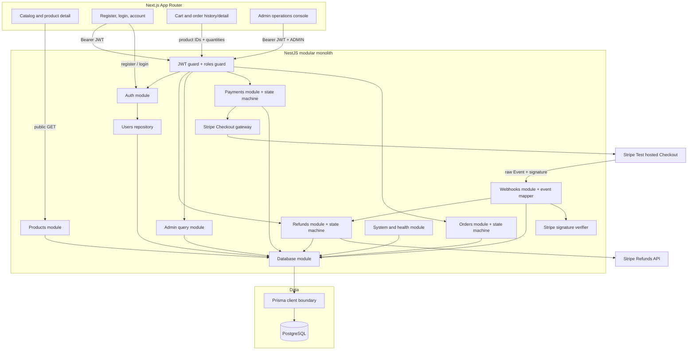

# PayFlow architecture

## Current boundary: Stage 6 accepted

Stage 6 adds a deterministic, database-backed Failure Lab around the payment,
webhook, refund, transaction, and RBAC boundaries delivered through Stage 5.
The V1 modular-monolith boundary and core domain model remain unchanged.

## Locked V1 constraints

- Next.js + TypeScript with App Router for user and admin web surfaces.
- NestJS + TypeScript as the sole business-rule and authorization boundary.
- REST + OpenAPI/Swagger for public interfaces.
- PostgreSQL as system of record and Prisma for schema, migration, seed, and
  access.
- Integer minor units for money fields; floating-point money is forbidden.
- Order and Payment remain separate domain objects when their stages arrive.
- V1 remains a modular monolith; worker and provider packages are deferred to
  their specified V2 stages.

## Stage 1 identity boundary

- Authentication uses short-lived HS256 bearer JWTs containing only `sub` and
  `role`, with issuer and audience checks.
- Passwords are hashed with bcrypt cost 12. Inputs that bcrypt would truncate
  beyond 72 UTF-8 bytes are rejected.
- Global guards make routes authenticated by default. Explicit `@Public()`
  metadata opens system, health, registration, login, and product reads.
- Public registration always writes `USER`; only the controlled seed can create
  or promote the Stage 1 `ADMIN` identity.
- `/admin/profile` proves the API-side RBAC boundary; Stage 5 administration
  routes reuse the same server-side guard.
- Authentication endpoints are limited to five requests per minute per tracker;
  the remaining API uses a 120-request-per-minute baseline.

## Stage 2 order boundary

- The browser cart is a convenience surface, not a pricing authority. `POST
/orders` accepts only `productId` and `quantity`; unknown price fields fail
  request validation.
- The Orders repository reloads products and creates the order plus all item
  snapshots in one serializable PostgreSQL transaction.
- The API rejects missing/inactive products, mixed currencies, quantities above
  stock, integer overflow, and malformed carts before persistence.
- `subtotal_amount`, `total_amount`, `unit_price_amount`, and
  `line_total_amount` are integer minor units. PostgreSQL checks enforce
  nonnegative amounts and arithmetic consistency.
- List, detail, and cancellation queries include the JWT subject in their
  database predicate. Foreign orders return the same 404 as absent orders.
- Every status mutation passes through the explicit order transition function.
  Stage 2 exposes only `PENDING_PAYMENT → CANCELLED`; later transitions remain
  inaccessible until their specified stages.

## Stage 3 payment boundary

- `POST /payments/checkout-session` accepts only an owned order ID. Local item
  snapshots and totals supply Stripe's Checkout line items.
- `Payment` is separate from `Order`; it stores the order amount/currency,
  provider state, attempt number, Checkout references, and a stable idempotency
  key before any third-party request.
- Payment reservation and pending-order cancellation take the same transaction-
  scoped PostgreSQL advisory lock. Serializable retries are bounded.
- Provider calls occur outside database transactions and have individual
  `PaymentAttempt` audit rows. Stripe results are checked against local amount
  and currency before the explicit `CREATED → PENDING` transition.
- The result page reads the protected local API and ignores redirect query data.
  A browser return cannot mark an order paid; Stage 4 webhook handling is the
  final authority.

## Stage 4 webhook boundary

- `POST /webhooks/stripe` is public at the JWT layer but authenticates the
  sender cryptographically with the `Stripe-Signature` header and exact raw
  request bytes. Missing configuration or invalid signatures fail closed before
  persistence.
- Only sandbox events are accepted. The mapper handles Checkout completion,
  asynchronous Checkout outcomes, and PaymentIntent processing/success/failure;
  unknown or unrelated signed events are durably marked `IGNORED`.
- Every verified event is stored in `webhook_events` as JSONB. A unique
  `provider_event_id` is the final deduplication boundary; a transaction-scoped
  advisory lock makes concurrent duplicate deliveries converge before the
  unique constraint is reached.
- Recognized events lock the order/payment concurrency boundary, verify local
  IDs, provider references, amount, and currency, then call explicit transition
  functions. `Payment → SUCCEEDED` and `Order → PAID` commit in the same locked
  transaction.
- Terminal success/refund states cannot move backward when an older failed or
  processing event arrives. Deterministic integrity failures persist as
  `FAILED` and return a non-2xx response without changing business state.

## Stage 5 refund and administration boundary

- `POST /admin/payments/:id/refunds` requires ADMIN and accepts a stable request
  UUID, audit reason, and optional positive integer amount. Omitting amount
  means the full remaining balance.
- The repository takes the shared order advisory lock plus order/payment row
  locks before summing pending and successful Refund rows. Reservation and
  `REFUND_REQUESTED` audit commit before the provider call.
- Stripe receives `refund:create:{paymentId}:{refundRequestId}`. Unknown network
  outcomes remain `PENDING` for same-key retry; deterministic provider rejection
  becomes `FAILED`.
- Direct provider responses and signed `refund.created`, `refund.updated`, and
  `refund.failed` events use the same locked projection. They validate local and
  provider IDs, amount, and currency before explicit Refund, Payment, and Order
  transitions.
- `charge.refunded` is retained as a signed audit-only event under the current
  Stripe Refund event model, preventing two competing detail sources.
- All administrator list endpoints are filtered, bounded, paginated, and
  supported by status/time/provider indexes. Refund dashboard totals are grouped
  by currency.
- The Next.js operations console renders dashboard, order/payment detail,
  provider attempts, full/partial refund submission, webhook delivery counts
  and errors, and audit metadata. Browser visibility never replaces API RBAC.

## Stage 6 verification boundary

- The dedicated Failure Lab drives the real NestJS HTTP surface and PostgreSQL
  repositories while substituting deterministic Stripe sandbox gateways. This
  keeps provider outcomes reproducible without weakening application locks,
  transactions, validation, raw-body signature checks, or authorization.
- Five concurrent payment requests must converge on one Payment and one stable
  provider idempotency key. A provider timeout after acceptance is retried with
  that same key and records both attempts.
- Duplicate and out-of-order signed events exercise the durable webhook inbox
  and terminal-state protections. A simulated process termination proves that
  provider retry restores consistency.
- A temporary database constraint injects failure between the Payment and Order
  writes. The webhook transaction must roll back both writes and its inbox row
  before a clean replay succeeds.
- Duplicate and concurrent refund requests prove business-key idempotency and
  the cumulative refund ceiling. A USER request proves the API-side 403 boundary.
- The ten scenarios run in GitHub Actions after migrations and seed, and remain
  independently reproducible with `pnpm test:failure-lab`.

## Data boundary

`users` stores UUID identity, normalized unique email, bcrypt password hash,
role, and timestamp. `products` stores UUID, SKU, display name, integer
minor-unit price, three-letter currency, stock, and active state. `orders`
stores ownership, display number, state, currency, integer totals, and creation
time. `order_items` stores the product reference plus immutable SKU, name, unit
price, quantity, and line-total snapshots. `payments` stores provider lifecycle,
amount, idempotency, and Checkout references; `payment_attempts` records provider
calls. PostgreSQL checks enforce lowercase
emails, nonnegative money/stock, positive item quantities, arithmetic equality,
and uppercase three-letter currency. `refunds` stores request/provider identity,
integer amount, lifecycle, reason, and provider failure details. `audit_logs`
stores administrator/system actor, action, target, JSON metadata, and timestamp.
`webhook_events` stores the original verified Event JSON, provider ID/type,
delivery count, processing state/error, and receive/process timestamps; none of
these tables store card numbers or CVC data added by PayFlow.

## Runtime topology

Docker Compose starts three services:

1. `postgres` owns persistent local database data.
2. `api` applies committed migrations, runs the idempotent admin/product seed,
   then serves REST, health, and Swagger.
3. `web` serves the responsive catalog and browser-based auth surfaces.

The API validates environment variables at startup. Request IDs and the shared
`code`, `message`, `requestId`, and `details` error envelope remain in force.

## Deferred boundaries

- Provider adapters — Stage 7.
- `apps/worker`, Redis/BullMQ, PayPal, outbox, ledger, and reconciliation —
  their specified later stages.
