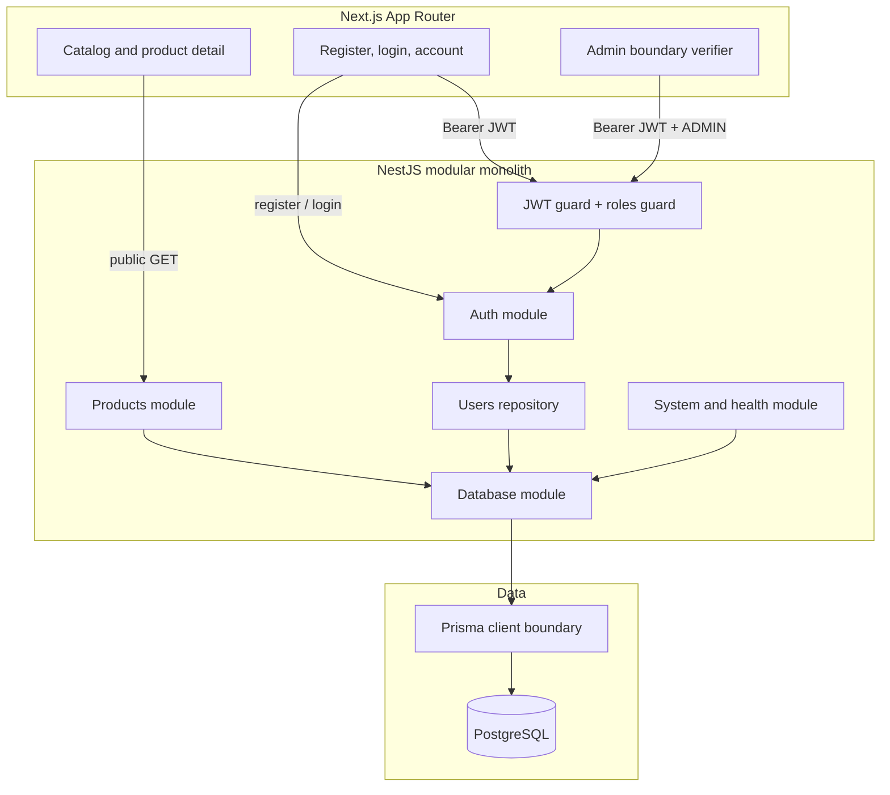

# PayFlow architecture

## Current boundary: Stage 1

Stage 1 adds identity, role enforcement, and a public read-only product catalog
without crossing into the Stage 2 order domain.

## Locked V1 constraints

- Next.js + TypeScript with App Router for user and admin web surfaces.
- NestJS + TypeScript as the sole business-rule and authorization boundary.
- REST + OpenAPI/Swagger for public interfaces.
- PostgreSQL as system of record and Prisma for schema, migration, seed, and
  access.
- Integer minor units for money fields; floating-point money is forbidden.
- Order and Payment remain separate domain objects when their stages arrive.
- V1 remains a modular monolith; worker and provider packages are deferred to
  their specified V2 stages.

## Stage 1 identity boundary

- Authentication uses short-lived HS256 bearer JWTs containing only `sub` and
  `role`, with issuer and audience checks.
- Passwords are hashed with bcrypt cost 12. Inputs that bcrypt would truncate
  beyond 72 UTF-8 bytes are rejected.
- Global guards make routes authenticated by default. Explicit `@Public()`
  metadata opens system, health, registration, login, and product reads.
- Public registration always writes `USER`; only the controlled seed can create
  or promote the Stage 1 `ADMIN` identity.
- `/admin/profile` proves the API-side RBAC boundary. It intentionally contains
  no Stage 5 refund or operations behavior.
- Authentication endpoints are limited to five requests per minute per tracker;
  the remaining API uses a 120-request-per-minute baseline.

## Data boundary

`users` stores UUID identity, normalized unique email, bcrypt password hash,
role, and timestamp. `products` stores UUID, SKU, display name, integer minor-unit
price, three-letter currency, stock, and active state. PostgreSQL checks enforce
lowercase emails, nonnegative price/stock, and uppercase three-letter currency.

## Runtime topology

Docker Compose starts three services:

1. `postgres` owns persistent local database data.
2. `api` applies committed migrations, runs the idempotent admin/product seed,
   then serves REST, health, and Swagger.
3. `web` serves the responsive catalog and browser-based auth surfaces.

The API validates environment variables at startup. Request IDs and the shared
`code`, `message`, `requestId`, and `details` error envelope remain in force.

## Deferred boundaries

- Orders and cart submission — Stage 2.
- Stripe checkout and payment records — Stage 3.
- Webhooks — Stage 4.
- Refund operations and the admin business console — Stage 5.
- `apps/worker`, Redis/BullMQ, provider packages, outbox, ledger, and
  reconciliation — their specified later stages.
