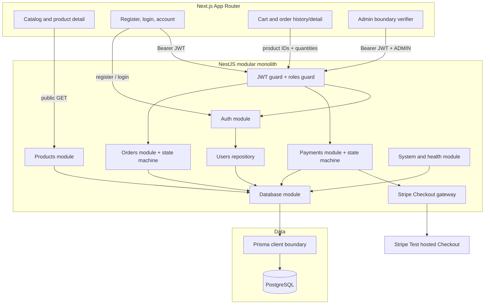

# PayFlow architecture

## Current boundary: Stage 3 accepted

Stage 3 adds the separate payment aggregate, Stripe-hosted Test Checkout, stable
provider idempotency, and local payment-status UI. Its real hosted-page gate has
passed; Stage 4 webhook processing has not begun.

## Locked V1 constraints

- Next.js + TypeScript with App Router for user and admin web surfaces.
- NestJS + TypeScript as the sole business-rule and authorization boundary.
- REST + OpenAPI/Swagger for public interfaces.
- PostgreSQL as system of record and Prisma for schema, migration, seed, and
  access.
- Integer minor units for money fields; floating-point money is forbidden.
- Order and Payment remain separate domain objects when their stages arrive.
- V1 remains a modular monolith; worker and provider packages are deferred to
  their specified V2 stages.

## Stage 1 identity boundary

- Authentication uses short-lived HS256 bearer JWTs containing only `sub` and
  `role`, with issuer and audience checks.
- Passwords are hashed with bcrypt cost 12. Inputs that bcrypt would truncate
  beyond 72 UTF-8 bytes are rejected.
- Global guards make routes authenticated by default. Explicit `@Public()`
  metadata opens system, health, registration, login, and product reads.
- Public registration always writes `USER`; only the controlled seed can create
  or promote the Stage 1 `ADMIN` identity.
- `/admin/profile` proves the API-side RBAC boundary. It intentionally contains
  no Stage 5 refund or operations behavior.
- Authentication endpoints are limited to five requests per minute per tracker;
  the remaining API uses a 120-request-per-minute baseline.

## Stage 2 order boundary

- The browser cart is a convenience surface, not a pricing authority. `POST
/orders` accepts only `productId` and `quantity`; unknown price fields fail
  request validation.
- The Orders repository reloads products and creates the order plus all item
  snapshots in one serializable PostgreSQL transaction.
- The API rejects missing/inactive products, mixed currencies, quantities above
  stock, integer overflow, and malformed carts before persistence.
- `subtotal_amount`, `total_amount`, `unit_price_amount`, and
  `line_total_amount` are integer minor units. PostgreSQL checks enforce
  nonnegative amounts and arithmetic consistency.
- List, detail, and cancellation queries include the JWT subject in their
  database predicate. Foreign orders return the same 404 as absent orders.
- Every status mutation passes through the explicit order transition function.
  Stage 2 exposes only `PENDING_PAYMENT → CANCELLED`; later transitions remain
  inaccessible until their specified stages.

## Stage 3 payment boundary

- `POST /payments/checkout-session` accepts only an owned order ID. Local item
  snapshots and totals supply Stripe's Checkout line items.
- `Payment` is separate from `Order`; it stores the order amount/currency,
  provider state, attempt number, Checkout references, and a stable idempotency
  key before any third-party request.
- Payment reservation and pending-order cancellation take the same transaction-
  scoped PostgreSQL advisory lock. Serializable retries are bounded.
- Provider calls occur outside database transactions and have individual
  `PaymentAttempt` audit rows. Stripe results are checked against local amount
  and currency before the explicit `CREATED → PENDING` transition.
- The result page reads the protected local API and ignores redirect query data.
  A browser return cannot mark an order paid; Stage 4 webhook handling will be
  the final authority.

## Data boundary

`users` stores UUID identity, normalized unique email, bcrypt password hash,
role, and timestamp. `products` stores UUID, SKU, display name, integer
minor-unit price, three-letter currency, stock, and active state. `orders`
stores ownership, display number, state, currency, integer totals, and creation
time. `order_items` stores the product reference plus immutable SKU, name, unit
price, quantity, and line-total snapshots. `payments` stores provider lifecycle,
amount, idempotency, and Checkout references; `payment_attempts` records provider
calls. PostgreSQL checks enforce lowercase
emails, nonnegative money/stock, positive item quantities, arithmetic equality,
and uppercase three-letter currency.

## Runtime topology

Docker Compose starts three services:

1. `postgres` owns persistent local database data.
2. `api` applies committed migrations, runs the idempotent admin/product seed,
   then serves REST, health, and Swagger.
3. `web` serves the responsive catalog and browser-based auth surfaces.

The API validates environment variables at startup. Request IDs and the shared
`code`, `message`, `requestId`, and `details` error envelope remain in force.

## Deferred boundaries

- Webhooks — Stage 4.
- Refund operations and the admin business console — Stage 5.
- `apps/worker`, Redis/BullMQ, provider packages, outbox, ledger, and
  reconciliation — their specified later stages.
