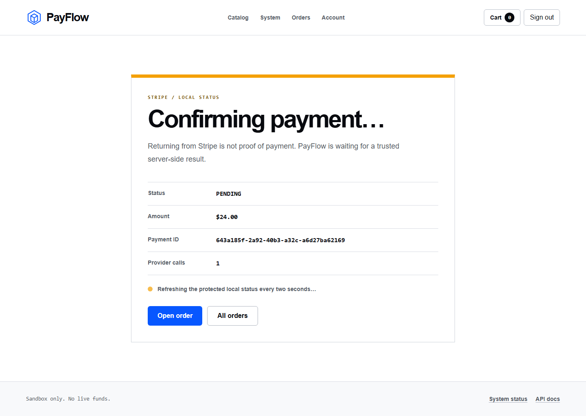
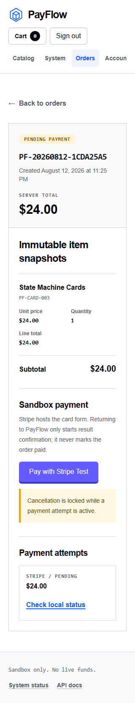

# Stage 3 payment UI record

Stage 3 extends the established PayFlow interface with a single Stripe-purple
hosted-checkout action and a local-status result surface. It preserves the
black, white, blue, amber, mint, and red system introduced in earlier stages.

## Interaction rules

- The order remains the context for starting payment; the browser sends only
  its ID.
- The primary payment action explicitly says `Stripe Test` so sandbox behavior
  cannot be mistaken for live collection.
- Returning from Stripe produces a confirming state, not a success claim.
- The result page ignores all redirect query values and polls the protected
  local payment endpoint every two seconds while status is nonterminal.
- Missing provider configuration is visible, actionable, and leaves the user on
  the order page.
- Mobile content uses stacked facts and cards; identifiers wrap instead of
  widening the viewport.

## QA captures

Desktop local-status confirmation:

Mobile order payment surface:

