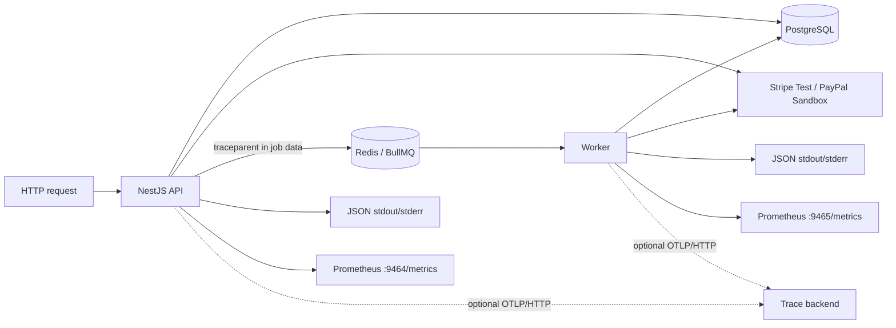

# PayFlow observability runbook

Stage 10 adds operational evidence around the existing payment boundaries. It
does not make telemetry authoritative: PostgreSQL business rows, audit logs,
webhook inbox rows, outbox rows, and ledger constraints remain the source of
truth.

## Signal map



OpenTelemetry traces and metrics are stable in the JavaScript implementation,
while its logs signal is still under development. PayFlow therefore uses the
OpenTelemetry SDK for traces/metrics and a small explicit JSON logger for a
stable, tested log contract. SDK initialization occurs before importing NestJS
or worker bootstrap modules, as required for library instrumentation.

## JSON log contract

Every record is one JSON object followed by a newline. Common fields are:

| Field                                           | Meaning                                   |
| ----------------------------------------------- | ----------------------------------------- |
| `timestamp`, `level`, `service`, `event`        | Stable envelope                           |
| `requestId`                                     | Incoming `x-request-id` or generated UUID |
| `traceId`, `spanId`                             | Active OpenTelemetry context when present |
| `orderId`, `paymentId`, `refundId`              | Available local aggregate identity        |
| `provider`, `providerEventId`, `webhookEventId` | Provider/event correlation                |

Request completion records add method, path, status, and duration. Worker
records add transition/duplicate/attempt outcomes. The exception filter emits
structured 5xx records and preserves the same request ID returned in the error
envelope.

The sanitizer recursively redacts keys containing authorization, cookie,
credential, password, secret, signature, token, or API-key terms. It also
redacts Stripe/PayPal-style secret values and bearer credentials inside strings,
limits array/depth traversal, and serializes errors as name/message/stack.
Controllers and workers intentionally do not log request bodies, webhook raw
payloads, provider response bodies, JWTs, payment credentials, or headers.

## Trace contract

Automatic spans cover HTTP/Express, `pg`, ioredis, and Undici calls. Manual
business spans make provider/queue boundaries searchable:

- `provider.payment.create`
- `provider.refund.create`
- `provider.webhook.verify`
- `queue.publish.webhook` / `queue.process.webhook`
- `queue.publish.outbox` / `queue.process.outbox`
- `outbox.publish.batch`
- `reconciliation.run` / `provider.payment.reconcile`

Producer spans inject W3C `traceparent` and optional `tracestate` into BullMQ job
data. Consumer spans extract them, so a trace continues across API → queue →
worker. Retries create new consumer spans under the original producer context;
PostgreSQL attempt counters remain the authoritative retry record.

Set either `OTEL_EXPORTER_OTLP_TRACES_ENDPOINT` (full traces URL) or
`OTEL_EXPORTER_OTLP_ENDPOINT` (collector base URL). The latter automatically
adds `/v1/traces`. With neither set, a no-op exporter accepts finished spans and
the application makes no collector connection; logs and metrics still work.

## Metric contract

API metrics listen on `127.0.0.1:9464` in local development; worker metrics use
`127.0.0.1:9465`. Compose binds both host ports to loopback. Exact names:

| Metric                               | Type      | Increment/observe rule           | Labels                   |
| ------------------------------------ | --------- | -------------------------------- | ------------------------ |
| `payment_success_total`              | Counter   | Payment newly becomes successful | `provider`               |
| `payment_failed_total`               | Counter   | Payment newly becomes failed     | `provider`               |
| `webhook_duplicate_total`            | Counter   | Authenticated duplicate delivery | `provider`               |
| `webhook_processing_seconds`         | Histogram | Every worker attempt             | `provider`, `outcome`    |
| `refund_failed_total`                | Counter   | Refund newly becomes failed      | `provider`               |
| `reconciliation_issue_total`         | Counter   | New open issue, not refresh      | `provider`, `issue_type` |
| `inbox_received_total`               | Counter   | Verified durable Inbox receipt   | `provider`               |
| `inbox_dispatch_lag_seconds`         | Histogram | Receipt-to-queue delay           | `provider`               |
| `inbox_dispatch_failure_total`       | Counter   | Failed Dispatcher enqueue        | `provider`               |
| `inbox_dispatch_retry_delay_seconds` | Histogram | Persisted dispatch retry delay   | `provider`               |
| `inbox_oldest_event_age_seconds`     | Histogram | Oldest pending Inbox age         | none                     |
| `webhook_event_conflict_total`       | Counter   | Verified ID/content collision    | `provider`               |

IDs, request paths, emails, error messages, and provider event types are not
metric labels; this prevents cardinality growth and accidental sensitive data.
Prometheus counters may be absent before their first event, which is expected.

Useful starter alerts for a real deployment:

```promql
increase(payment_failed_total[15m]) > 5
increase(refund_failed_total[15m]) > 0
increase(reconciliation_issue_total[30m]) > 0
increase(inbox_dispatch_failure_total[10m]) > 0
increase(webhook_event_conflict_total[5m]) > 0
histogram_quantile(0.95, sum by (le) (rate(inbox_dispatch_lag_seconds_bucket[10m]))) > 5
histogram_quantile(0.95, sum by (le) (rate(webhook_processing_seconds_bucket[10m]))) > 2
```

Tune thresholds against traffic and page only on actionable symptoms. A
duplicate webhook increase alone is usually informational because deduplication
is an expected provider delivery behavior.

## Readiness and local verification

`GET /health` returns 200 only after both a PostgreSQL query and a Redis queue
readiness check succeed:

```json
{
  "status": "ok",
  "service": "payflow-api",
  "checks": { "database": "up", "redis": "up" },
  "timestamp": "2026-08-13T00:00:00.000Z"
}
```

After `docker compose up --build --wait`:

```powershell
Invoke-RestMethod http://localhost:4000/health
(Invoke-WebRequest http://localhost:9464/metrics).Content
(Invoke-WebRequest http://localhost:9465/metrics).Content
docker compose logs api worker --tail 20
pnpm test:stage-10
```

The Stage 10 suite verifies JSON parsing/redaction, W3C parent continuity, all
six exact Prometheus names, a real PostgreSQL/Redis health response, caller
request-ID preservation, and the reported implementation stage.

## Troubleshooting

- Empty business counters immediately after startup are normal; generate the
  corresponding transition or run the contract test.
- A health failure means either PostgreSQL or Redis is unavailable. Inspect
  `docker compose ps` and the structured API error record.
- Missing traces usually mean the endpoint is not an OTLP/HTTP receiver or its
  base path is wrong. Prefer the full `.../v1/traces` environment variable when
  the backend publishes a nonstandard path.
- Do not solve export errors by logging credentials or webhook bodies. Keep
  diagnostics to endpoint host, status class, request/trace IDs, and safe error
  codes.

References: [OpenTelemetry JavaScript status](https://opentelemetry.io/docs/languages/js/),
[exporters](https://opentelemetry.io/docs/languages/js/exporters/),
[instrumentation libraries](https://opentelemetry.io/docs/languages/js/libraries/),
and [context propagation](https://opentelemetry.io/docs/languages/js/propagation/).
