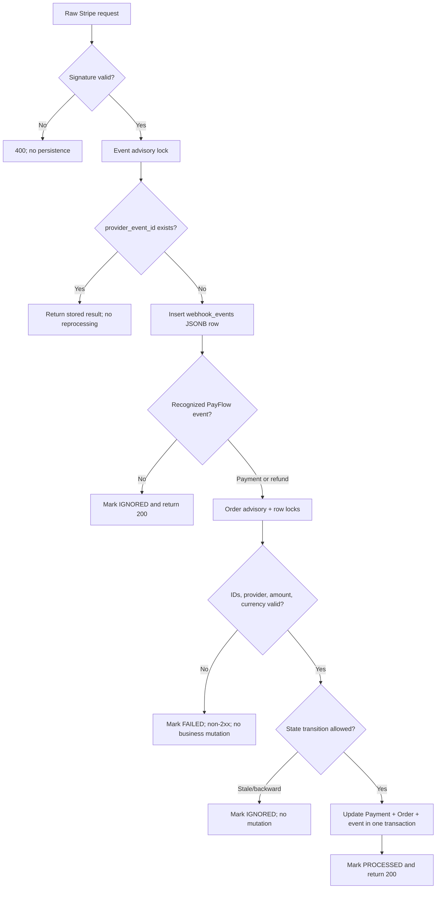

# Stripe webhook reliability design

## Trust boundary

`POST /webhooks/stripe` does not use a user JWT. It authenticates Stripe with the
endpoint-specific `Stripe-Signature` header and the exact raw request `Buffer`.
NestJS starts with `rawBody: true`; parsing or reserializing JSON before
verification is forbidden. `STRIPE_WEBHOOK_SECRET` must begin with `whsec_`, and
the application accepts only events whose `livemode` flag is false.

Invalid signatures return `400` and create no event or business-state row. A
missing signing secret returns `503`. Secrets, authorization headers, and raw
signature values are never logged.

## Processing pipeline



The event lock handles concurrent delivery cheaply; the unique index on
`provider_event_id` remains the durable final defense. Payloads are stored as
the verified Stripe Event JSON in PostgreSQL JSONB for audit and debugging.
PayFlow never enriches that payload with card numbers, CVC, secrets, or browser
credentials.

## Transaction and state rules

- The inbox insert, event result, Refund/Payment/Order update, and optional
  system audit use one `READ COMMITTED` transaction with explicit advisory and
  row locks. Queries after a waited lock see the newest committed state.
- Order-scoped advisory locking is shared with payment reservation and unpaid
  cancellation. Database row locks serialize distinct events for one payment.
- Every state change calls the explicit Payment or Order transition function.
- A successful event can move `PENDING`/`PROCESSING → SUCCEEDED` and
  `PENDING_PAYMENT → PAID` atomically.
- Current Stripe `refund.created`, `refund.updated`, and `refund.failed` events
  validate the local Refund ID, PaymentIntent, amount, and currency before
  moving `PENDING → SUCCEEDED | FAILED` and projecting aggregate refund state.
- `charge.refunded` is signed and persisted but audit-only; current Refund
  events are the detailed lifecycle authority.
- Once a Payment is successful or in a refund state, an older processing or
  failure event is persisted as `IGNORED`; status cannot move backward.
- A repeat of the same successful provider Event returns the persisted result.
  It does not rerun state changes, even when deliveries arrive concurrently.
- Unknown signed events are acknowledged after persistence so an endpoint can
  safely receive a broader Stripe event set.

## Local verification

Use Stripe CLI forwarding and the `whsec_...` value printed by that listener:

```powershell
stripe listen --events checkout.session.completed,checkout.session.async_payment_succeeded,checkout.session.async_payment_failed,payment_intent.processing,payment_intent.succeeded,payment_intent.payment_failed,refund.created,refund.updated,refund.failed,charge.refunded --forward-to localhost:4000/webhooks/stripe
```

The automated E2E suite uses Stripe's official signing helper against the real
NestJS raw-body route and PostgreSQL. It proves valid and invalid signatures,
five concurrent duplicate deliveries, unknown events, integrity rejection,
pending refund finalization, duplicate Refund delivery, and out-of-order
protection without requiring a network tunnel in CI.
