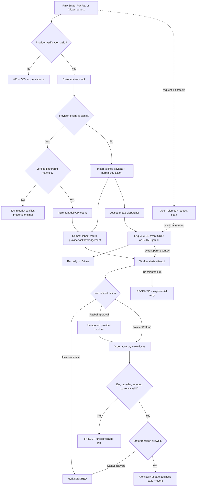

# Provider webhook queue reliability design

## Trust boundary

`POST /webhooks/stripe`, `POST /webhooks/paypal`, and
`POST /webhooks/alipay` are public at the JWT layer, but none accepts
unauthenticated provider data:

- Stripe verifies `Stripe-Signature` against the exact raw request `Buffer` and
  the endpoint-specific `whsec_...` secret. Live-mode events are rejected.
- PayPal forwards the exact raw event plus `paypal-transmission-*`, certificate,
  algorithm, and configured Sandbox webhook ID to PayPal's official
  `/v1/notifications/verify-webhook-signature` endpoint. Only `SUCCESS` passes.
- Alipay accepts only form-urlencoded notifications, verifies the decoded field
  set with the official SDK's RSA2 verifier, and then checks app ID, seller ID,
  Payment UUID (`out_trade_no`), and exact CNY amount.

Missing configuration returns `503`; missing raw bytes or invalid signatures
return `400` before persistence. Secrets, authorization headers, OAuth tokens,
and raw signatures are never logged.

## Request and worker pipeline



The API does not wait for Redis, `Worker`, or `Atomic`. A provider `2xx` (or
Alipay's exact plain-text `success`) means the authenticated event is durably
stored in PostgreSQL. BullMQ dispatch and business processing follow
asynchronously; PostgreSQL remains the source of truth.

## Persistence and recovery rules

- `webhook_events.provider_event_id` is unique and guarded by an event-scoped
  advisory lock. Its canonical SHA-256 fingerprint binds verified content to the
  ID. Matching duplicates increment `delivery_count`; a different fingerprint
  returns `WEBHOOK_EVENT_ID_CONFLICT` without mutating the original row.
- The normalized action is persisted with the verified payload, so a worker
  restart never needs to trust a new unsigned reconstruction.
- Redis is not contacted by the receipt path. A queue failure leaves the row
  `RECEIVED` with `queued_at IS NULL`; the Dispatcher records a bounded error,
  releases its lease, and persists `next_dispatch_at`. Retry uses a five-second
  exponential base, deterministic jitter, and a fifteen-minute cap while
  retaining the same deterministic job ID.
- Dispatcher selection excludes rows already assigned `queued_at`, so a Worker
  transient failure that restores `RECEIVED` cannot create a second queue job.
- `processing_attempts`, `last_processing_started_at`, `processing_error`, and
  `processed_at` make retries and terminal failure visible independent of Redis
  retention.
- Worker projection uses explicit Order, Payment, and Refund transitions under
  transaction-scoped advisory/row locks. A business update and terminal event
  result commit atomically.
- Successful/refunded Payment state cannot move backward when an older pending
  or failed event arrives.

## Retry and dead-letter behavior

Inbox-to-Redis dispatch and Worker processing are deliberately separate retry
planes. Dispatch selects only due rows, so deferred failures neither hot-loop
nor occupy the next active batch. It has no automatic discard limit because the
provider event has already been acknowledged; repeated failure remains visible
and recoverable in PostgreSQL.

The Worker queue uses five total attempts and exponential backoff from one second.
Provider network/timeout, rate-limit, and 5xx failures retry. Deterministic
integrity, amount/currency, identity, missing-record, and state-machine failures
are permanent and use BullMQ's unrecoverable path after one attempt.

Completed jobs are retained for one day/up to 1,000. Failed jobs are retained
for seven days/up to 2,000 and form the Stage 8 dead-letter operations surface.
`GET /admin/queues/webhooks` exposes counts, states, timestamps, safe failure
messages, and attempt totals without exposing payloads or credentials.

## Local verification

Start PostgreSQL, Redis, API, worker, and web, then forward provider webhooks to
their matching endpoint. For Stripe CLI:

```powershell
stripe listen --events checkout.session.completed,checkout.session.async_payment_succeeded,checkout.session.async_payment_failed,payment_intent.processing,payment_intent.succeeded,payment_intent.payment_failed,refund.created,refund.updated,refund.failed,charge.refunded --forward-to localhost:4000/webhooks/stripe
```

Use the listener's exact `whsec_...` in the ignored API/worker environment.
PayPal requires Sandbox client credentials plus the webhook ID configured for
`http(s)://<host>/webhooks/paypal`. Alipay requires sandbox keys and a notify
URL ending in `/webhooks/alipay`; a valid notification is acknowledged with
exact body `success` and `text/plain` content type.

The Stage 8 E2E suite drives both providers through the same API, persists and
queues signed/verified provider-shaped events, runs the actual worker, injects
one transient PayPal capture failure, then proves two attempts, final paid
state, and ADMIN queue visibility. A real Redis integration test independently
proves BullMQ retry and retained attempt telemetry.

## Stage 10 telemetry

Every accepted request has a response `x-request-id` and a JSON completion log.
Verified provider identity/event identity and available order/payment/refund IDs
enrich the same context without logging signatures or payload credentials.
Duplicate authenticated deliveries increment `webhook_duplicate_total`. Every
worker attempt records `webhook_processing_seconds`; payment/refund counters
increment only when the locked projection actually changes state, so queue
replay does not inflate business outcomes. See `docs/observability.md`.

Stage 11 additionally exports `inbox_received_total`,
`inbox_dispatch_lag_seconds`, `inbox_dispatch_failure_total`, and
`inbox_oldest_event_age_seconds`. Alert on sustained lag/age or repeated
dispatch failure; an acknowledged `RECEIVED` event is recoverable but must not
remain undispatched silently.

Stage 12 adds `inbox_dispatch_retry_delay_seconds` and
`webhook_event_conflict_total`. A conflict is an integrity incident, not an
expected duplicate, and should page or open a high-priority investigation.
