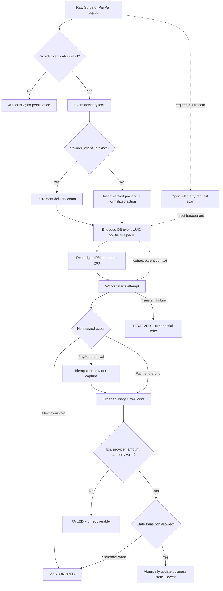

# Provider webhook queue reliability design

## Trust boundary

`POST /webhooks/stripe` and `POST /webhooks/paypal` are public at the JWT layer,
but neither accepts unauthenticated provider data:

- Stripe verifies `Stripe-Signature` against the exact raw request `Buffer` and
  the endpoint-specific `whsec_...` secret. Live-mode events are rejected.
- PayPal forwards the exact raw event plus `paypal-transmission-*`, certificate,
  algorithm, and configured Sandbox webhook ID to PayPal's official
  `/v1/notifications/verify-webhook-signature` endpoint. Only `SUCCESS` passes.

Missing configuration returns `503`; missing raw bytes or invalid signatures
return `400` before persistence. Secrets, authorization headers, OAuth tokens,
and raw signatures are never logged.

## Request and worker pipeline



The API does not wait for `Worker` or `Atomic`. The provider's `2xx` response
means the authenticated event is durably stored and queued. PostgreSQL is the
business source of truth; BullMQ retains delivery/retry evidence.

## Persistence and recovery rules

- `webhook_events.provider_event_id` is unique and guarded by an event-scoped
  advisory lock. Duplicate deliveries increment `delivery_count` and do not
  create another domain event.
- The normalized action is persisted with the verified payload, so a worker
  restart never needs to trust a new unsigned reconstruction.
- If Redis enqueue fails after the insert, the HTTP request fails. A provider
  retry sees the existing `RECEIVED` row and safely retries the same job ID.
- `processing_attempts`, `last_processing_started_at`, `processing_error`, and
  `processed_at` make retries and terminal failure visible independent of Redis
  retention.
- Worker projection uses explicit Order, Payment, and Refund transitions under
  transaction-scoped advisory/row locks. A business update and terminal event
  result commit atomically.
- Successful/refunded Payment state cannot move backward when an older pending
  or failed event arrives.

## Retry and dead-letter behavior

The queue uses five total attempts and exponential backoff from one second.
Provider network/timeout, rate-limit, and 5xx failures retry. Deterministic
integrity, amount/currency, identity, missing-record, and state-machine failures
are permanent and use BullMQ's unrecoverable path after one attempt.

Completed jobs are retained for one day/up to 1,000. Failed jobs are retained
for seven days/up to 2,000 and form the Stage 8 dead-letter operations surface.
`GET /admin/queues/webhooks` exposes counts, states, timestamps, safe failure
messages, and attempt totals without exposing payloads or credentials.

## Local verification

Start PostgreSQL, Redis, API, worker, and web, then forward provider webhooks to
their matching endpoint. For Stripe CLI:

```powershell
stripe listen --events checkout.session.completed,checkout.session.async_payment_succeeded,checkout.session.async_payment_failed,payment_intent.processing,payment_intent.succeeded,payment_intent.payment_failed,refund.created,refund.updated,refund.failed,charge.refunded --forward-to localhost:4000/webhooks/stripe
```

Use the listener's exact `whsec_...` in the ignored API/worker environment.
PayPal requires Sandbox client credentials plus the webhook ID configured for
`http(s)://<host>/webhooks/paypal`.

The Stage 8 E2E suite drives both providers through the same API, persists and
queues signed/verified provider-shaped events, runs the actual worker, injects
one transient PayPal capture failure, then proves two attempts, final paid
state, and ADMIN queue visibility. A real Redis integration test independently
proves BullMQ retry and retained attempt telemetry.

## Stage 10 telemetry

Every accepted request has a response `x-request-id` and a JSON completion log.
Verified provider identity/event identity and available order/payment/refund IDs
enrich the same context without logging signatures or payload credentials.
Duplicate authenticated deliveries increment `webhook_duplicate_total`. Every
worker attempt records `webhook_processing_seconds`; payment/refund counters
increment only when the locked projection actually changes state, so queue
replay does not inflate business outcomes. See `docs/observability.md`.
